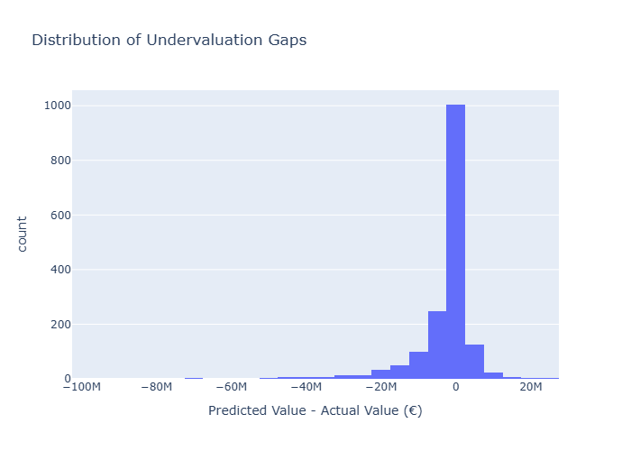

# Identifying Undervalued Football Players Using Machine Learning

## Project Overview
This project uses 2025/26 football player performance data from Europe’s top five leagues to estimate player market value and identify potentially undervalued players.

The model compares a player's actual market value with a predicted value based on statistical performance. Players whose predicted value is higher than their actual value are treated as possible undervaluation candidates.

##  Problem
Football clubs often overpay for high-profile players while missing lower-cost players with strong statistical profiles. This project explores whether data science can support scouting decisions by identifying players whose performance suggests a higher market value than their current valuation.

## Dataset
Source: Kaggle football player statistics dataset for the 2025/26 season.

The project uses:
- Player performance statistics
- Market value data
- Position and league information

## Methodology
1. Exploratory Data Analysis
2. Data cleaning and feature engineering
3. Market value prediction using Random Forest Regression
4. Model evaluation using MAE, RMSE and R²
5. Identification of undervalued players
6. Visual analysis by player, position and league

## Key Results
- A Random Forest model was trained to estimate player market value.
- Market value was log-transformed due to heavy skew.
- Value-related columns were removed from model features to prevent data leakage.
- Players below €1m were filtered from final undervaluation rankings to reduce noisy low-value outliers.

## Key Visuals

### Actual vs Predicted Market Value


### Top Undervalued Players by Absolute Gap


### Top Undervalued Players by Percentage Gap


### Market Value Distribution


### Undervaluation Gap Distribution


### Average Undervaluation Gap by Position


### Average Undervaluation Gap by League


## Repository Structure
```text
notebooks/   Full analysis workflow
visuals/     Exported charts for portfolio presentation
data/        Sample output files only
