# Identifying Undervalued Football Players Using Machine Learning

## Executive Summary
This project uses 2025/26 player performance data from Europe’s top five leagues to estimate player market value and identify potentially undervalued footballers.

A Random Forest regression model was trained to predict a player’s current “fair” market value based on statistical performance. Players whose predicted value exceeded their actual market value were flagged as potential undervaluation candidates.

---

## Problem
Football clubs often overpay for high-profile players while missing lower-cost players with strong statistical profiles. This project explores whether machine learning can support scouting decisions by identifying players whose performance suggests a higher market value than their current valuation.

---

## Dataset
The dataset was sourced from Kaggle and contains player-level statistics for the 2025/26 season across Europe’s top five leagues.

The project uses:
- Player performance statistics
- Market value data
- Position information
- League information

---

## Project Workflow
1. Exploratory Data Analysis  
2. Data Cleaning and Feature Engineering  
3. Market Value Modelling  
4. Model Evaluation  
5. Undervalued Player Identification  
6. Visualisation and Insights  

---

## Exploratory Data Analysis
Initial exploration was conducted to understand the dataset structure, missing values, league coverage, position distributions and market value range.

The dataset contained a heavily skewed market value distribution, with a small number of elite players valued far above the majority of the dataset.

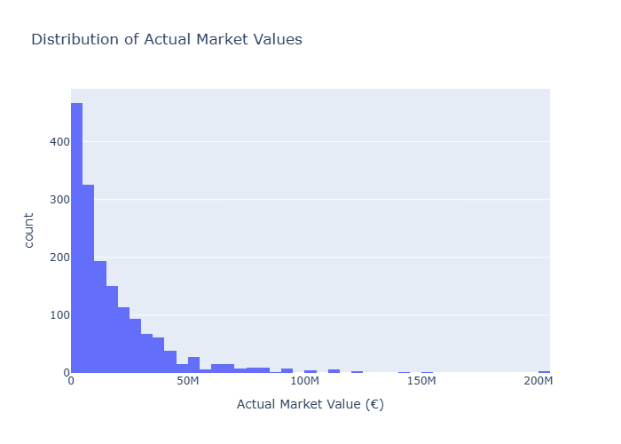

---

## Data Cleaning and Feature Engineering
Key preprocessing steps included:

- Filtering noisy low-value player records
- Cleaning player names for matching
- Handling missing values
- Creating per-90 performance metrics
- Creating attacking contribution features
- Encoding league and position variables
- Removing value-related columns from model inputs to prevent data leakage

A major part of the project involved checking valuation fields carefully. External valuation data was tested but found to be inconsistent, so the more realistic market value column from the main dataset was used.

---

## Modelling Approach
A Random Forest Regressor was used to estimate market value from player statistics.

Random Forest was chosen because:
- It handles non-linear relationships well
- It works effectively with mixed football performance features
- It provides feature importance for interpretation
- It is less sensitive to outliers than simpler linear models

Market value was log-transformed because the distribution was highly skewed.

---

## Model Evaluation
The model was evaluated using:

- Mean Absolute Error (MAE)
- Root Mean Squared Error (RMSE)
- R² score

The predicted values were compared with actual values to assess model performance.

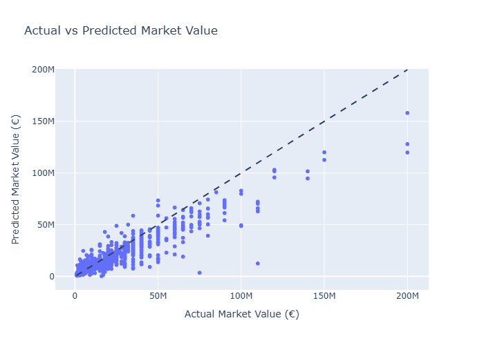

---

## Identifying Undervalued Players

Players were ranked using:

**Undervaluation Gap = Predicted Market Value − Actual Market Value**

A positive gap suggests that a player’s statistical profile is stronger than their current market value, indicating a potential undervaluation opportunity.

Two approaches were used:

- **Absolute Gap**: Highlights players with the largest financial difference  
- **Percentage Gap**: Identifies lower-cost players who may offer high relative value  

### Top Undervalued Players by Absolute Gap
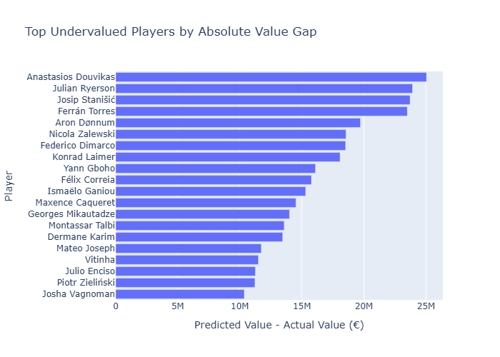

### Top Undervalued Players by Percentage Gap
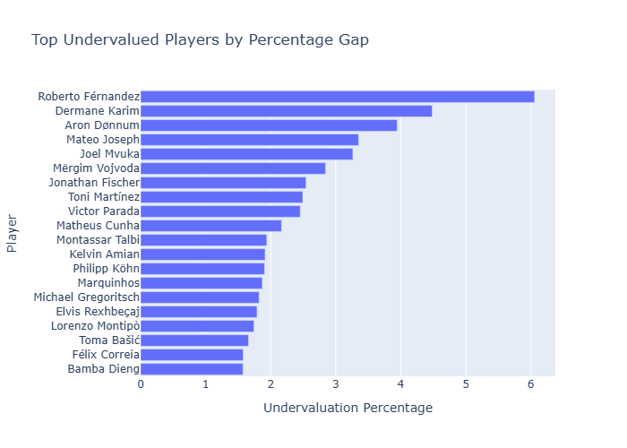

## Position-Based Analysis

To gain deeper insight, undervaluation was analysed across different position groups.

This helps identify whether certain types of players (e.g. forwards vs defenders) are more likely to be undervalued based on performance data.

### Goalkeepers
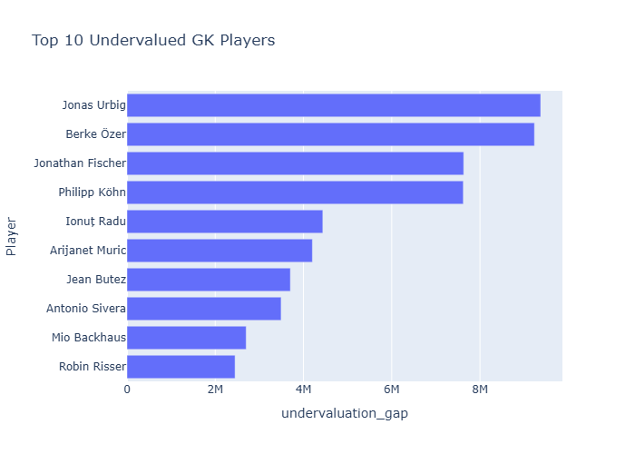

### Defenders
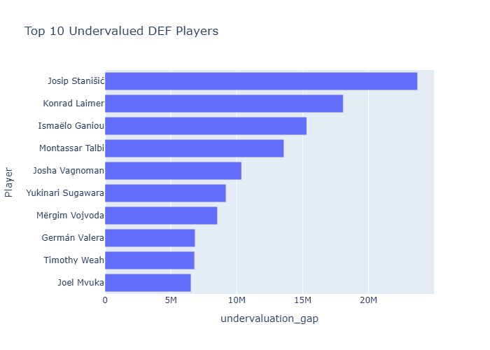

### Midfielders
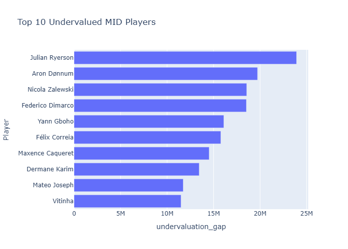

### Forwards
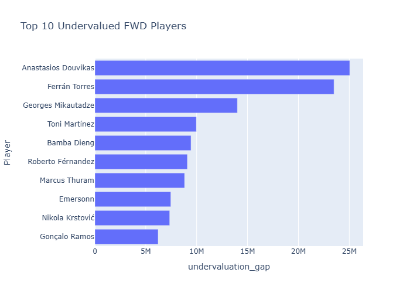


## League-Based Analysis

Undervaluation was also analysed across the top five European leagues to identify potential differences in market efficiency.

This helps highlight whether certain leagues offer better value opportunities based on player performance relative to market value.

### Premier League
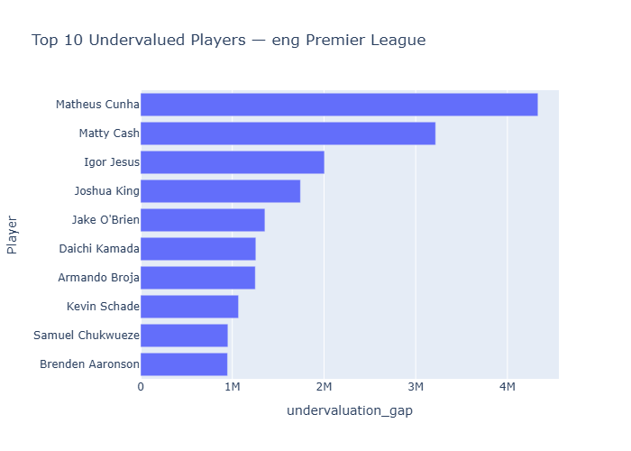

### La Liga
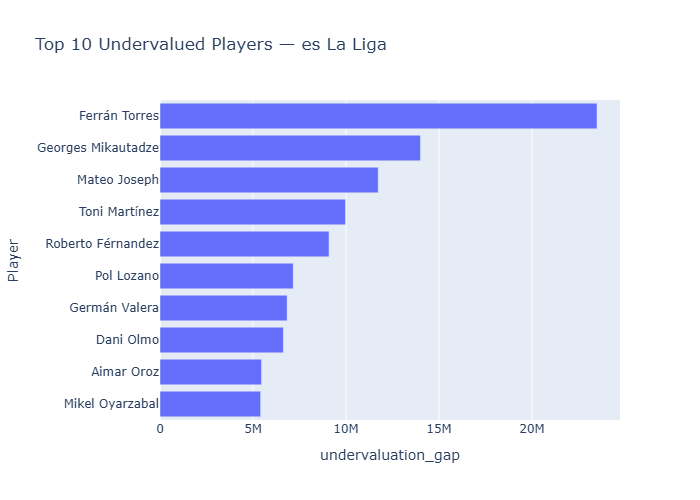

### Serie A
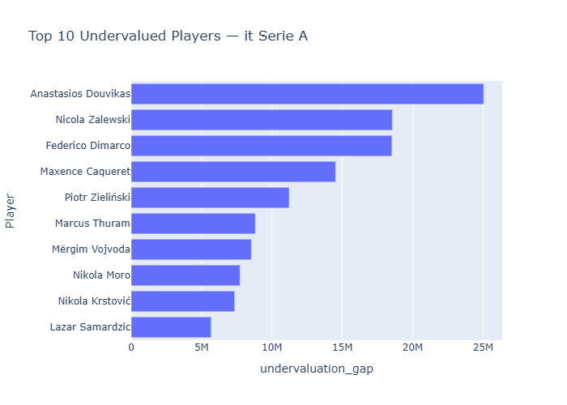

### Bundesliga
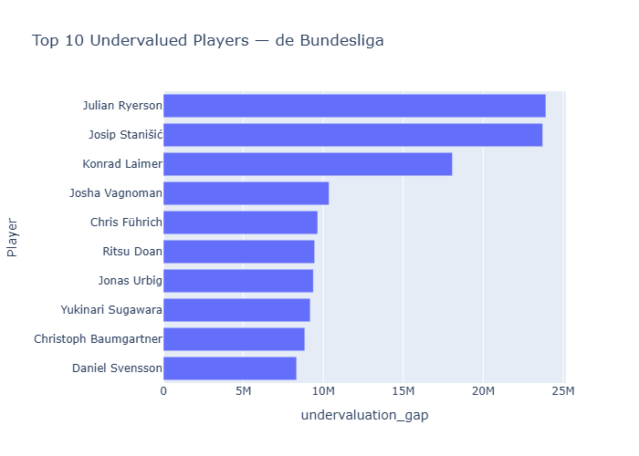

### Ligue 1
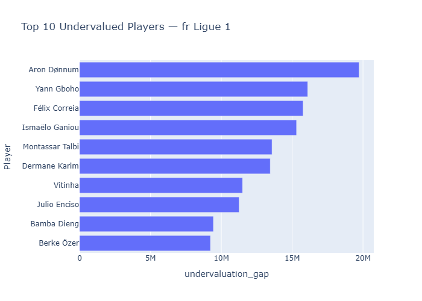


## Key Insights

- Market value is highly skewed, with a small number of elite players valued significantly higher than the majority of players. This justified the use of a log transformation during modelling.
- The model is able to identify players whose statistical performance suggests a higher value than their current market valuation.
- Absolute undervaluation highlights players with the largest potential financial discrepancies.
- Percentage undervaluation helps identify lower-cost players who may represent strong value-for-money opportunities.
- Undervaluation patterns vary across positions and leagues, suggesting that market inefficiencies are not uniform.

---

## Limitations

Market value is influenced by many factors not fully captured in performance data, including:

- Contract length  
- Injury history  
- Club reputation  
- Player popularity and media influence  
- Transfer demand and market conditions  
- Tactical fit within a team  

As a result, the model should be interpreted as a decision-support tool rather than a definitive valuation system.

---

## Future Improvements

The project could be improved by:

- Incorporating multiple seasons of historical data  
- Including contract length and injury history  
- Testing alternative models such as XGBoost or LightGBM  
- Adding player similarity clustering to identify comparable players  
- Developing an interactive dashboard using Streamlit  
- Applying SHAP values to improve model interpretability  

---

## Repository Structure
notebooks/ Full analysis workflow
visuals/ Exported charts for portfolio presentation
data/ Sample output files only


---

## Tools Used

- Python  
- Pandas  
- NumPy  
- Scikit-learn  
- Plotly  
- Matplotlib  
- Seaborn  
- Jupyter Notebook  

---

## How to Run

1. Clone this repository:
```
git clone https://github.com/AXJAS/football-undervalued-players-2025-2026.git
cd football-undervalued-players-2025-2026
```
2.Install requirements:
  ```
  pip install -r requirements.txt
  ```
3.Open and run the notebooks in order:

  01_EDA.ipynb  
  02_Data_Cleaning_and_Feature_Engineering.ipynb  
  03_Modelling_and_Undervalued_Players.ipynb  
  04_Visualisations_and_Insights.ipynb  


